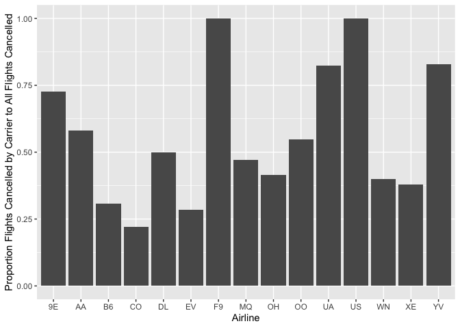
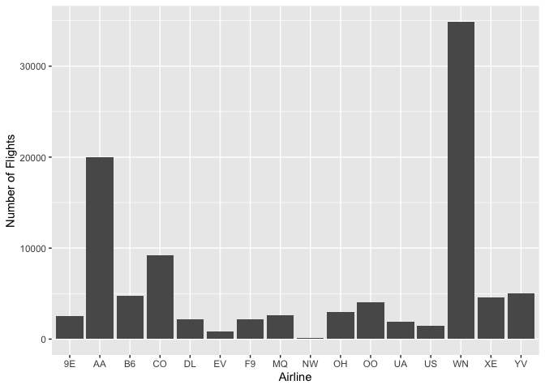
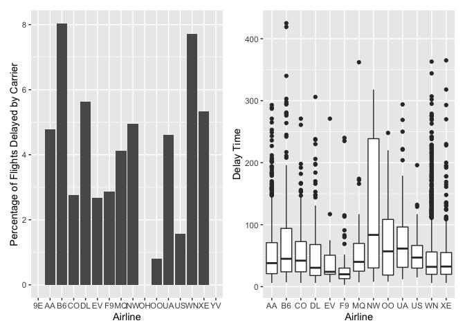
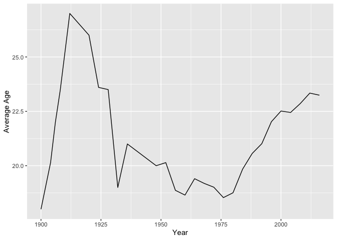
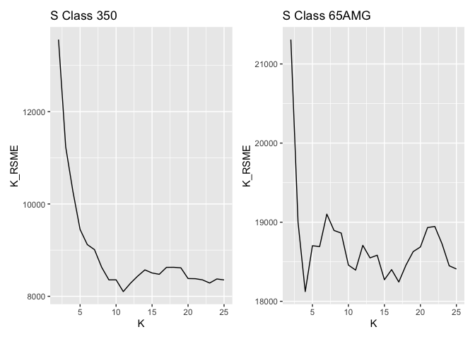
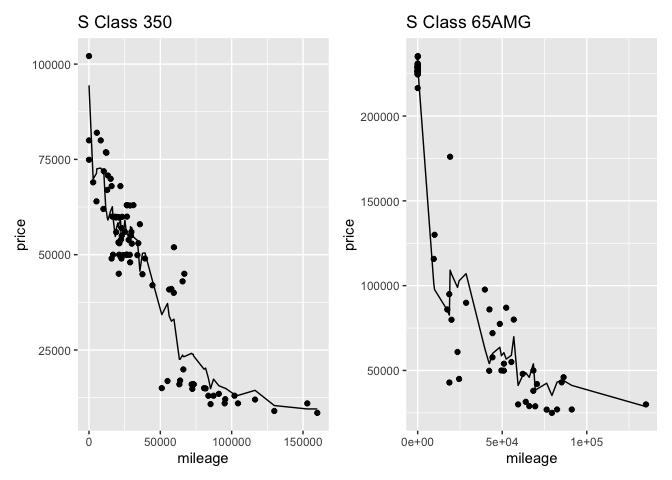

\##1. Data Visualization: Flights at ABIA

In this section, I want to find to give insight into which airline to
fly in order to minimize the chances of having a cancelled flight and
minimize the time of delay. In other words, I want to answer the
following: 1. Which airlines have the least proportion of cancellations
given that the cancellation was due to the carrier? 2. Which airlines
have the least proportion of delays by the carrier? 3. Given that there
is a delay by the carrier, which airline has the shortest delays?

    ## Rows: 99260 Columns: 29
    ## ── Column specification ────────────────────────────────────────────────────────
    ## Delimiter: ","
    ## chr  (5): UniqueCarrier, TailNum, Origin, Dest, CancellationCode
    ## dbl (24): Year, Month, DayofMonth, DayOfWeek, DepTime, CRSDepTime, ArrTime, ...
    ## 
    ## ℹ Use `spec()` to retrieve the full column specification for this data.
    ## ℹ Specify the column types or set `show_col_types = FALSE` to quiet this message.

\###Flight Cancellations

We can first look at the number of flights by airline. Worthy of note:
\* WN (Southwest Airlines), AA (American Airlines), and CO (Continental
Airlines) have the most flights going in and out of ABIA \* NW
(Northwest Airlines) had very few flights going in or out of ABIA and 0
cancelled flights in this year

We can then look to see which airlines had the highest percentage of
cancelled flights overall (in green). You may ask, what if some airlines
were unlucky and had more flights on bad weather days. We can then
compare the percentage of flights cancelled by the carrier for reasons
other than weather, NAS, or security (in red). So what are the takeaways
from the graphs below? \* If you want to minimize the chance of having
your flight cancelled, you probably should avoid MQ (Envoy Air). \* Also
worth of note is that although WN (Southwest Airlines) and CO
(Continental Airlines) are in the top 3 for number of flights in and out
of ABIA,they have relatively lower percentages of cancelled flights due
to non-airline related reasons.

In this graph, you can see the proportion of flights cancelled by the
carrier to the total number of cancelled flights by that airline.

\###Flight Delays

First, I want to keep in mind the total number of flights that each
airline has.

From the barplot, we can see the airlines that have the highest
percentages of delays, and from the boxplot, we can see the distribution
of the delay times. I want to note the following: 1. B6 (Jetblue) has
the 4th most number of flights and the highest percentage of flight
delays along with relatively higher delay times. 2. Although WN
(Southwest) has the most number of flights and high percentages of
delays, the delay times for this airline is relatively low.

\###Summary I want to separate the airlines into 2 categories. One
category for the airlines with the top three number of flights in and
out of ABIA, and a secondary category for all the other airlines.
\####WN(Southwest Airlines), AA(American Airlines), and CO(Continental
Airlines) Most likely, passengers will fly WN, AA, or CO. In terms of
cancellation, AA has the highest rates of cancellation whereas WN has
the lowest rates of cancellation. Especially impressive is that WN
manages about 1.5 times more flights than AA and more than 3 times more
flights than CO but still has the lowest rates of cancellation. WN has
the highest rates of delays but generally have lower delay times than
the other 2 airlines. In general, combining the factors of chances of
delay and times of delay, there is not an immediately noticeable
difference among the 3 airlines. One important aspect to note is that
although past performance can give insight, it does not determine what
will happen the future as can be seen from the recent mass cancellation
of WN due to their scheduling system failing. Although the weather
initially impacted their cancellations, the weather caused a major error
in their scheduling system that resulted in WN cancelling many other
flights, leaving passengers without a flight for days. \####All Other
Airlines The cancellation among all other airlines are varied. For
instance, MQ has the highest rates of cancellations among all airlines
while F9 has the lowest. B6 has the highest rates of delays and
relatively high delay times. F9 has a relatively lower rate of
cancellations and delay times. The key takeaway is that passengers
probably want to avoid MQ when flying among the other airlines.

\##2. Wrangling the Olympics

\###A. What is the 95th percentile of heights for female competitors
across all Athletics events (i.e., track and field)? Note that sport is
the broad sport (e.g. Athletics) whereas event is the specific event
(e.g. 100 meter sprint). The below Table shows the 95th percentile of
heights for female competitors across events.

\###B. Which single women’s event had the greatest variability in
competitor’s heights across the entire history of the Olympics, as
measured by the standard deviation? Rowing Women’s Coxed Fours have the
greatest variability as measured by standard deviation.

    ## # A tibble: 132 × 3
    ##    event                                   q95    sd
    ##    <chr>                                 <dbl> <dbl>
    ##  1 Rowing Women's Coxed Fours             184. 10.9 
    ##  2 Basketball Women's Basketball          198.  9.70
    ##  3 Rowing Women's Coxed Quadruple Sculls  183.  9.25
    ##  4 Rowing Women's Coxed Eights            188   8.74
    ##  5 Swimming Women's 100 metres Butterfly  185   8.13
    ##  6 Volleyball Women's Volleyball          193   8.10
    ##  7 Gymnastics Women's Uneven Bars         166   8.02
    ##  8 Shooting Women's Double Trap           182.  7.83
    ##  9 Cycling Women's Keirin                 182.  7.76
    ## 10 Swimming Women's 400 metres Freestyle  185.  7.62
    ## # … with 122 more rows

\###C. How has the average age of Olympic swimmers changed over time?
Does the trend look different for male swimmers relative to female
swimmers? Create a data frame that can allow you to visualize these
trends over time, then plot the data with a line graph with separate
lines for male and female competitors. Give the plot an informative
caption answering the two questions just posed.

We can see that overall, the average age for swimmers started young,
quickly increased and then decreased again. In the last few decades, the
average age gas gradually gone up.

The male swimmers follow generally the same trend as the swimmers
overall. However, female swimmers’ ages stayed stagnant from 1925 to
1975 and gradually increases after.

\##3. K-nearest neighbors: cars

    ## Rows: 29466 Columns: 17
    ## ── Column specification ────────────────────────────────────────────────────────
    ## Delimiter: ","
    ## chr (11): trim, subTrim, condition, color, displacement, fuel, state, region...
    ## dbl  (5): id, mileage, year, featureCount, price
    ## lgl  (1): isOneOwner
    ## 
    ## ℹ Use `spec()` to retrieve the full column specification for this data.
    ## ℹ Specify the column types or set `show_col_types = FALSE` to quiet this message.

### Split the data into a training and a testing set

    #train-test split
    sclass350_split = initial_split(sclass350, prop = 0.8)
    sclass350_train = training(sclass350_split)
    sclass350_test = testing(sclass350_split)

    sclass65_split = initial_split(sclass65, prop = 0.8)
    sclass65_train = training(sclass65_split)
    sclass65_test = testing(sclass65_split)

\###Run KNN to build a predictive model for price given mileage and
calculate the RMSE for each value of K for each trim

For each trim, the following plots show the RMSE versuse K so we can see
where the RMSE bottoms out. For the S class 350, it bottoms out at 10.
For the S Class 65AMG, it bottoms out at 4. The S Class 350 yields a
larger optimal value of K because the sample size is bigger.

In the following plots, we can visualize how well our predicted price
did compared to the actual price. The scatter plots represent the actual
prices of the vehicles and the line plots represent the predicted
prices.

    plot350 <- ggplot(data = sclass350_test) + 
      geom_point(mapping = aes(x = mileage, y = price)) + 
      geom_line(mapping = aes(x = mileage, y = predicted_price)) +
      ggtitle("S Class 350") 

    plot65 <- ggplot(data = sclass65_test) + 
      geom_point(mapping = aes(x = mileage, y = price)) + 
      geom_line(mapping = aes(x = mileage, y = predicted_price)) +
      ggtitle("S Class 65AMG") 

    plot350 + plot65

