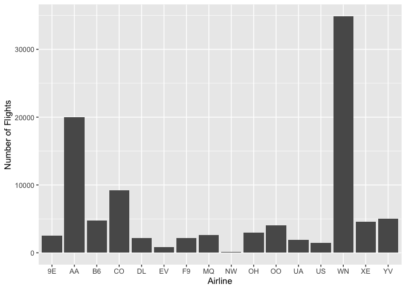
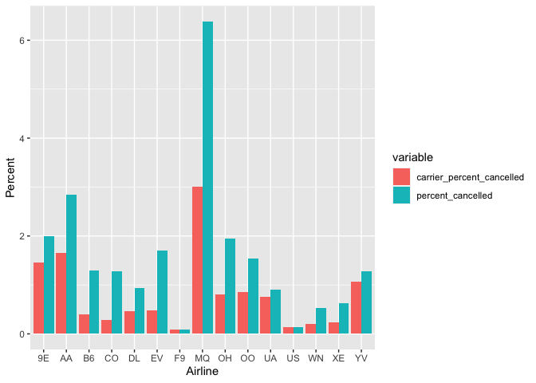
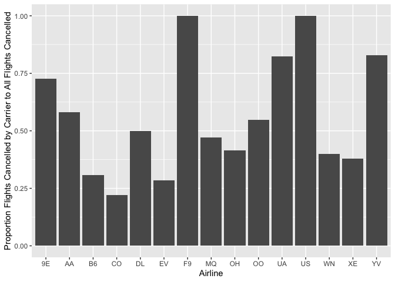
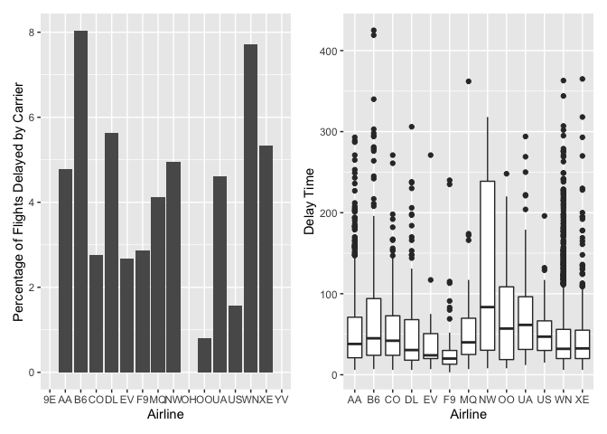
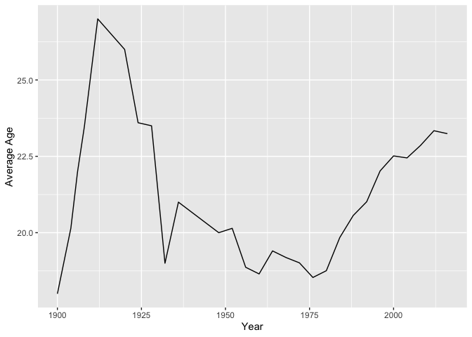
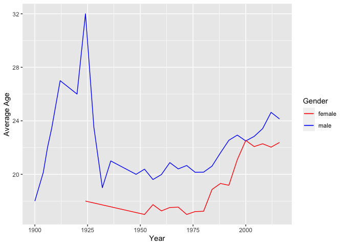
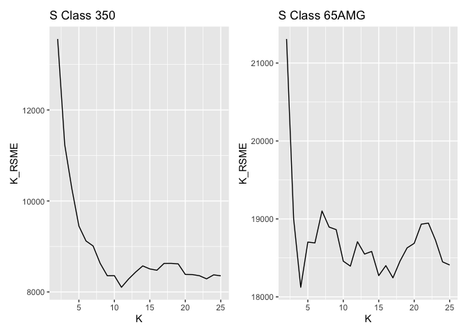
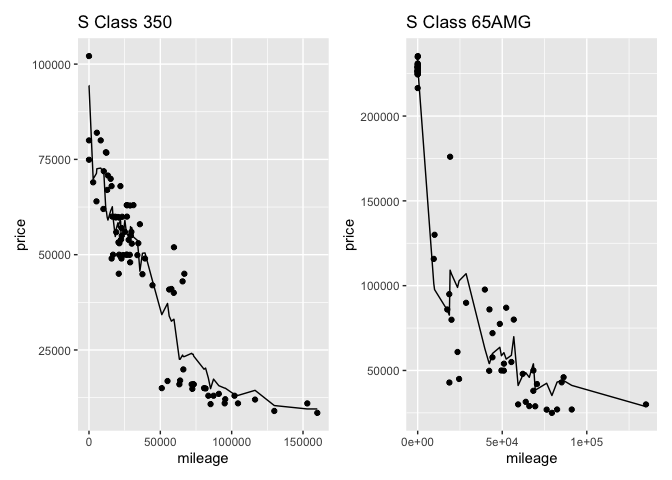

## 1. Data Visualization: Flights at ABIA

In this section, I want to find to give insight into which airline to
fly in order to minimize the chances of having a cancelled flight and
minimize the time of delay. In other words, I want to answer the
following: 1. Which airlines have the least proportion of cancellations
given that the cancellation was due to the carrier? 2. Which airlines
have the least proportion of delays by the carrier? 3. Given that there
is a delay by the carrier, which airline has the shortest delays?

### Flight Cancellations

We can first look at the number of flights by airline. Worthy of note:
\* WN (Southwest Airlines), AA (American Airlines), and CO (Continental
Airlines) have the most flights going in and out of ABIA \* NW
(Northwest Airlines) had very few flights going in or out of ABIA and 0
cancelled flights in this year

  

 

We can then look to see which airlines had the highest percentage of
cancelled flights overall (in green). You may ask, what if some airlines
were unlucky and had more flights on bad weather days. We can then
compare the percentage of flights cancelled by the carrier for reasons
other than weather, NAS, or security (in red). So what are the takeaways
from the graphs below? \* If you want to minimize the chance of having
your flight cancelled, you probably should avoid MQ (Envoy Air). \* Also
worth of note is that although WN (Southwest Airlines) and CO
(Continental Airlines) are in the top 3 for number of flights in and out
of ABIA,they have relatively lower percentages of cancelled flights due
to non-airline related reasons.

  

In this graph, you can see the proportion of flights cancelled by the
carrier to the total number of cancelled flights by that airline.

### Flight Delays

First, I want to keep in mind the total number of flights that each
airline has.

From the barplot, we can see the airlines that have the highest
percentages of delays, and from the boxplot, we can see the distribution
of the delay times. I want to note the following: 1. B6 (Jetblue) has
the 4th most number of flights and the highest percentage of flight
delays along with relatively higher delay times. 2. Although WN
(Southwest) has the most number of flights and high percentages of
delays, the delay times for this airline is relatively low.

  

### Summary

I want to separate the airlines into 2 categories. One category for the
airlines with the top three number of flights in and out of ABIA, and a
secondary category for all the other airlines. \#### WN(Southwest
Airlines), AA(American Airlines), and CO(Continental Airlines) Most
likely, passengers will fly WN, AA, or CO. In terms of cancellation, AA
has the highest rates of cancellation whereas WN has the lowest rates of
cancellation. Especially impressive is that WN manages about 1.5 times
more flights than AA and more than 3 times more flights than CO but
still has the lowest rates of cancellation. WN has the highest rates of
delays but generally have lower delay times than the other 2 airlines.
In general, combining the factors of chances of delay and times of
delay, there is not an immediately noticeable difference among the 3
airlines. One important aspect to note is that although past performance
can give insight, it does not determine what will happen the future as
can be seen from the recent mass cancellation of WN due to their
scheduling system failing. Although the weather initially impacted their
cancellations, the weather caused a major error in their scheduling
system that resulted in WN cancelling many other flights, leaving
passengers without a flight for days. \#### All Other Airlines The
cancellation among all other airlines are varied. For instance, MQ has
the highest rates of cancellations among all airlines while F9 has the
lowest. B6 has the highest rates of delays and relatively high delay
times. F9 has a relatively lower rate of cancellations and delay times.
The key takeaway is that passengers probably want to avoid MQ when
flying among the other airlines.

## 2. Wrangling the Olympics

### A. What is the 95th percentile of heights for female competitors across all Athletics events (i.e., track and field)? Note that sport is the broad sport (e.g. Athletics) whereas event is the specific event (e.g. 100 meter sprint).

The below Table shows the 95th percentile of heights for female
competitors.

    ## # A tibble: 1 × 2
    ##     q95    sd
    ##   <dbl> <dbl>
    ## 1   186  9.24

### B. Which single women’s event had the greatest variability in competitor’s heights across the entire history of the Olympics, as measured by the standard deviation?

Rowing Women’s Coxed Fours have the greatest variability as measured by
standard deviation. Also available is the 95th percentile of heights for
female competitors for each athletic event (only top 10 values of
standard deviations are shown).

 

    ## # A tibble: 132 × 3
    ##    event                                   q95    sd
    ##    <chr>                                 <dbl> <dbl>
    ##  1 Rowing Women's Coxed Fours             184. 10.9 
    ##  2 Basketball Women's Basketball          198.  9.70
    ##  3 Rowing Women's Coxed Quadruple Sculls  183.  9.25
    ##  4 Rowing Women's Coxed Eights            188   8.74
    ##  5 Swimming Women's 100 metres Butterfly  185   8.13
    ##  6 Volleyball Women's Volleyball          193   8.10
    ##  7 Gymnastics Women's Uneven Bars         166   8.02
    ##  8 Shooting Women's Double Trap           182.  7.83
    ##  9 Cycling Women's Keirin                 182.  7.76
    ## 10 Swimming Women's 400 metres Freestyle  185.  7.62
    ## # … with 122 more rows

### C. How has the average age of Olympic swimmers changed over time? Does the trend look different for male swimmers relative to female swimmers? Create a data frame that can allow you to visualize these trends over time, then plot the data with a line graph with separate lines for male and female competitors. Give the plot an informative caption answering the two questions just posed.

We can see that overall, the average age for swimmers started young,
quickly increased and then decreased again. In the last few decades, the
average age gas gradually gone up.

  

The male swimmers follow generally the same trend as the swimmers
overall. However, female swimmers’ ages stayed stagnant from 1925 to
1975 and gradually increases after.

  

## 3. K-nearest neighbors: cars

### Split the data into a training and a testing set

    #train-test split
    sclass350_split = initial_split(sclass350, prop = 0.8)
    sclass350_train = training(sclass350_split)
    sclass350_test = testing(sclass350_split)

    sclass65_split = initial_split(sclass65, prop = 0.8)
    sclass65_train = training(sclass65_split)
    sclass65_test = testing(sclass65_split)

### Run KNN to build a predictive model for price given mileage and calculate the RMSE for each value of K for each trim

For each trim, the following plots show the RMSE versuse K so we can see
where the RMSE bottoms out. For the S class 350, it bottoms out at 10.
For the S Class 65AMG, it bottoms out at 4. The S Class 350 yields a
larger optimal value of K because the sample size is bigger.

In the following plots, we can visualize how well our predicted price
did compared to the actual price. The scatter plots represent the actual
prices of the vehicles and the line plots represent the predicted
prices. 
