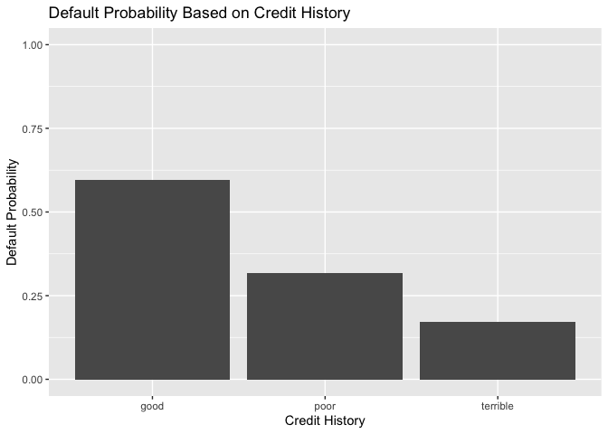
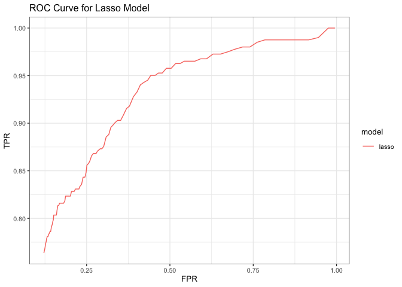
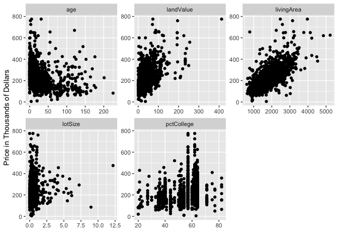
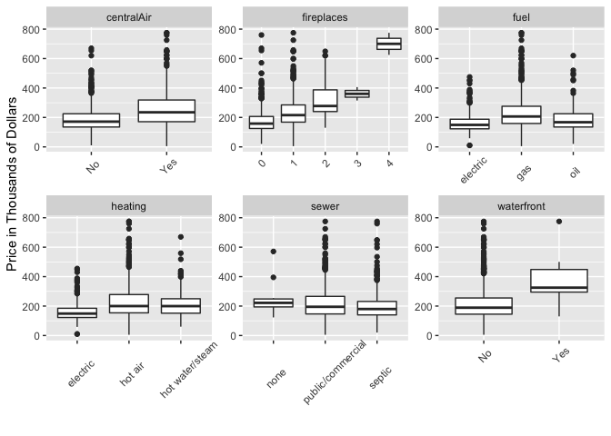
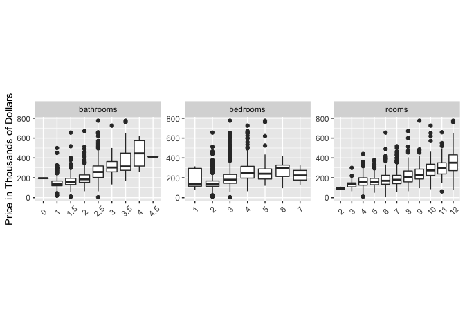

## 1. Saratoga House Prices

### a. Linear Model to Predict Price

 

The goal of this exercise is to build a linear model with the lowest
RMSE. The first thing to do is to explore the data in order to guide the
initial selection of variables for the model. You can find these plots
in Appendix 1. I will show three models in this exercise. The first is
the model from class, used as a reference. The second is a model with
hand-selected variables. The third is a stepwise regression model with
all the varialbes included in the second model and their two-way
interactions.

 

 

The first model is the medium model from class to use as a reference and
consists of the following:

    ## lm(formula = price ~ lotSize + age + livingArea + bedrooms + 
    ##     fireplaces + bathrooms + rooms + heating + fuel + centralAir, 
    ##     data = SaratogaHouses)

 

The second model is a model of my creation using exploratory data
analysis and tinkering with the formula. This model is also used as a
starting point for the stepwise regrsesion in the third model. In this
model, I did not include ‘newConstruction’ as it is captured in the
‘age’ variable. I also did not include ‘sewer’ as the boxplot showed no
noticeable affect on price. The second model consists of the following:

    ## lm(formula = price ~ lotSize + age + landValue + livingArea + 
    ##     pctCollege + bedrooms + fireplaces + bathrooms + rooms + 
    ##     heating + fuel + waterfront + centralAir, data = SaratogaHouses)

 

The third model runs stepwise regression with all the variables from the
second model and their 2-way interactions. The result of the stepwise
regression results in the following formula:

    ## lm(formula = price ~ lotSize + age + landValue + livingArea + 
    ##     pctCollege + bedrooms + fireplaces + bathrooms + rooms + 
    ##     heating + fuel + waterfront + centralAir + livingArea:centralAir + 
    ##     landValue:livingArea + age:landValue + livingArea:fuel + 
    ##     bathrooms:heating + landValue:pctCollege + pctCollege:fireplaces + 
    ##     livingArea:fireplaces + bedrooms:fireplaces + landValue:fireplaces + 
    ##     landValue:bathrooms + fireplaces:waterfront + lotSize:waterfront + 
    ##     fuel:centralAir + age:centralAir + age:pctCollege + lotSize:age + 
    ##     livingArea:pctCollege + lotSize:landValue + landValue:fuel + 
    ##     age:bathrooms + rooms:heating + bedrooms:heating, data = SaratogaHouses)

 

I now use K-fold cross validation (5 folds) to compare all the models.
The following shows the average RMSE for the 3 models:

    ## Model 1 (Medium Linear Model)- Mean RMSE: 66399.18

    ## Model 2 (Hand Selected Linear Model)- Mean RMSE: 59218.2

    ## Model 3 (Stepwise Linear Model)- Mean RMSE: 57509.64

 

### b. KNN Model to Predict Price

 

In order to conduct KNN, I first used my exploratory data analysis plots
to guide selection of initial variables. I then used Z-score scaling to
scale all the parameters. Lastly, I added and removed variables to test
which models returned the lowest RMSE.

 

    ## Using k=10 and K-fold cross validation with 5 folds, I got an average RMSE of: 60597.08

 

### c. Tax Authority Report

 

Overall, the Stepwise Regression Model performed the best in terms of
the root mean-squared error (RMSE) with an average RMSE of 57702.23. A
hand-selected linear model without any interactions placed second with
an average RMSE of 59378.08. The K-Nearest Neighbors (KNN) Regression
performed the worst with an average RMSE of 60597.08. So what do these
results mean for tax purposes?

 

If the tax authority wants the most accurate prediction for property
prices, the Stepwise Regression Model clearly outperforms the other
models. However, this model is hardly interpretable due to the many
interactions among the various attributes of the home. When homeowners
protest the value of their home in order to lower property taxes, this
model would be extremely difficult to explain to the court authorities
determining whether to decrease the value of a home. Consequently, I
recommend doing further analysis on and possibly using the hand-selected
linear model. The difference between the average RMSE is only
approximately 1700, whereas the decrease in property values after a
homeowner protests have sometimes been greater than 50,000. I purposely
hand-selected a model without transformations and interactions because
this model is highly interpretable. In other words, the tax authority
can point to specific aspects of the home and state the aggregate affect
of the various aspects of the home on the price. However, I would need
to do more analysis in regards to the assumptions of linearity,
independence, homoscedasticity, and normality.

 

At this point in the analysis, the KNN model has the best
interpretability as one can just say we used the following variables and
chose the houses that most resembled the homeowner’s house in those
aspects. In short, use the stepwise model if the only goal is to lower
RMSE. Look more into the hand selected model if the goal is to know the
affect of each parameter of the house price. Use KNN if the model needs
to be interpretable and is needed immediately to evaluate home prices.

 

Lastly, I do recommend collecting additional data as this will allow for
better models and lower RMSEs. In particular, I noticed that there is no
neighborhood/zip-code data. For example, downtown properties are usually
worth more than other areas. Or there may be particularly affluent
zip-codes etc. It is my intuition that this kind of data would
significantly improve the KNN model as well as improve the linear
models. Furthermore, how many stories a house has, whether the property
has a garage, and whether the property is in a school district could be
particularly helpful.

 

## 2. Classification and Retrospective Sampling

### a. Make a bar plot of default probability by credit history

We can see in the bar plot below that in this dataset, people with good
credit history has the highest probability of default and people with
terrible credit history had the lowest probability of default. This is
likely due to the way the bank chose to sample the data.

 

 

### b. Build a logistics regression model for predicting default probability

Using the variables specified on the homework assignment, I created a
logistic regression model. The logistics regression model returns
coefficients in log odds. I have converted the coefficients back to odds
in the output below. As can be seen from the output below, those with
poor history and terrible history in this model actually reduce the
probability that a given person would default.

 

    ##         (Intercept)            duration              amount         installment 
    ##               0.687               1.021               1.000               1.260 
    ##                 age         historypoor     historyterrible          purposeedu 
    ##               0.976               0.245               0.116               3.197 
    ## purposegoods/repair       purposenewcar      purposeusedcar       foreigngerman 
    ##               1.334               2.634               0.428               0.282

Before comparing models, we should always look at the base rate. The
following table shows the number of those that defaulted vs the number
of those that did not default. From the table, we can see that if were
to just predict that no one would default, we would get a 69% accuracy
rate.

    ## 
    ##   0   1 
    ## 138  62

Now taking a look at the confusion matrix (setting the threshold at
0.5), we can see that the model does not perform very well using this
data. Below shows the results of a confusion matrix on the out of sample
predictions. Especially concerning is the fact that out of the 62 people
who actually defaulted on their loan, this model predicted that 46 of
those would not default.

    ##    yhat
    ## y     0   1
    ##   0 122  16
    ##   1  46  16

    ## Using just one train-test split, the out of sample accuracy is: 0.69

    ## Using 5 folds, the average out of sample accuracy is 0.728

 

We can see from the ‘history’ variable in this logistic regression model
that having a poor credit history reduces the odds of defaulting by a
factor of more than 3, and having a terrible credit score reduces the
odds of default by a factor of more than 6. This is because bank
substantially over sampled the population of people who defaulted on the
loan. Consequently, this data set would not be appropriate in building a
predictive model because the data set is not representative of the
population of people who borrow from this bank. Using this data to for
prediction yielded an accuracy that is essentially no different than not
building a predictive model at all and just predicting that no one would
default. This data may be helpful during exploratory data analysis to
see what factors may possible contribute to defaults on loans.

 

Since the bank collects data on all of its customers, I would recommend
that the bank use the population or a randomly selected subset of the
population to design a predictive model. In particular, the bank has an
imbalanced classification problem. One way to deal with this is to
conduct random over-sampling, random under-sampling, or both. The bank
does need to ensure that it is not over over-sampling or over
under-sampling in their re-sample. Other techniques could involve using
different methods and techniques from the logistic regression model used
in this assignment.

## 3. Children and Hotel Reservations

### a. Model Building

Again, when building predictive models, we should always keep in mind
the base rate (shown in the table below). We note that approximately
91.92% of guests do not bring children so by not building any model and
just predicting that no guests would bring children, our accuracy would
be 91.92%.

    ## 
    ##     0     1 
    ## 41365  3635

All the subsequent models show the accuracy using K-fold Cross
Validation (with 5 folds). For example, when using folds 1-4 as the
training set, I generate predictions for fold 5. I loop through all the
folds (so each fold serves as a test set when generating particular
predictions for data in that fold) to generate out of sample predictions
for all the data in the hotels\_dev data set.

 

The following show the confusion matrix and accuracy for the baseline 1
model. Note that this model just predicted that no one would bring
children yielding the same 91.92% accuracy as the base rate.

    ##    yhat
    ## y       0
    ##   0 41365
    ##   1  3635

    ## [1] 0.9192222

The following show the confusion matrix and accuracy of the baseline 2
model. Note that the accuracy for this model increased slightly to
93.47%.

    ##    yhat
    ## y       0     1
    ##   0 40793   572
    ##   1  2365  1270

    ## [1] 0.9347333

Now I build my own model using Lasso Regression. However, I first
modified the datasets to include a binary variable called ‘weekend’ if
the arrival date is either Friday, Saturday, or Sunday. I also added a
categorical variable called ‘month’ from the arrival\_date. The
following show the accuracy of my model using lasso regression. This
lasso regression ran all variables and their two-way interactions. We
see that our accuracy increase to 94.22%.

    ##    yhat
    ## y       0     1
    ##   0 40911   452
    ##   1  2095  1540

    ## [1] 0.9433975

### b. Model Validation

Now is time for model validation. As always, we first look at the base
rate. We also see that the baseline 1 model just predicts that there
would be no children yielding an accuracy of 91.96%.

    ## 
    ##    0    1 
    ## 4597  402

    ##    yhat
    ## y      0
    ##   0 4597
    ##   1  402

    ## [1] 0.9195839

    ##    yhat
    ## y      0    1
    ##   0 4525   72
    ##   1  253  149

    ## [1] 0.934987

Using the lasso regression model with 2-way interactions, the validation
set yielded an accuracy of 94.42%,almost a whole percentage point
increase over the baseline 2 model.

    ##    yhat
    ## y      0    1
    ##   0 4545   52
    ##   1  227  175

    ## [1] 0.9441888

We can also see that the threshold to set in order to get the most
accurate predictions for the validation set is 0.51 yielding a slightly
greater accuracy of 94.44%. This is very minor and could be due to
randomness in the data. However, this re-affirms that the most accurate
threshold is approximately 0.5.

    ## Best threshold: 0.51

    ## Accuracy using best threshold: 0.9443889

To get a better understanding of how well my model performs, I use the
hotels\_val set to create 20 folds. In each fold, I calculated the
actual number of bookings with children, the expected number of bookings
with children, and the accuracy. The table below summarizes these
results. Note that the base rate prediction (predicting all adults)
yielded a 91.96% accuracy. My model performed better than the base rate
prediction in 18 out of 20 folds.

    ##    fold_number actual_bookings estimated_bookings fold_accuracy
    ## 1            1              18            21.4504        0.9680
    ## 2            2              15            19.3913        0.9600
    ## 3            3              24            20.5674        0.9280
    ## 4            4              14            18.9699        0.9600
    ## 5            5              18            20.7785        0.9440
    ## 6            6              21            22.9422        0.9520
    ## 7            7              22            23.4898        0.9280
    ## 8            8              20            19.5698        0.9400
    ## 9            9              16            20.3587        0.9440
    ## 10          10              30            22.5646        0.9160
    ## 11          11              22            22.3021        0.9440
    ## 12          12              20            22.4786        0.9400
    ## 13          13              17            19.5437        0.9600
    ## 14          14              17            21.8074        0.9560
    ## 15          15              19            17.8251        0.9400
    ## 16          16              25            20.9867        0.9240
    ## 17          17              36            28.6103        0.9160
    ## 18          18              15            18.9267        0.9640
    ## 19          19              13            13.3526        0.9600
    ## 20          20              20            22.4469        0.9398

## 4. Appendix of EDA Plots for Saratoga

