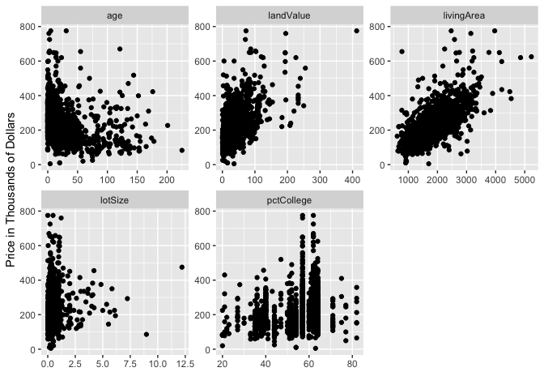
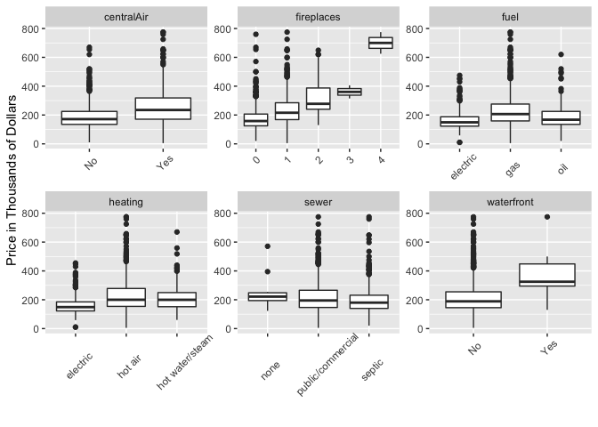
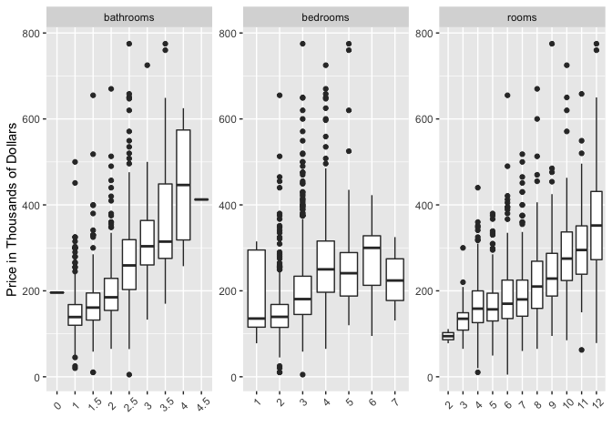

## 1. Saratoga House Prices

 

### a. Linear Model to Predict Price

 

The goal of this exercise is to build a linear model with the lowest
RMSE without much regard to interpretability. I will use Stepwise
Regression to do so.

 

Stepwise Regression requires an initial selection of variables. I first
want to look at some basic plots in order to guide my initial selection
of variables.

 

 

    ## Warning: attributes are not identical across measure variables;
    ## they will be dropped

 

 

For my initial selection of variables, I will not include
‘newConstruction’ as it is captured in the ‘age’ variable. I will also
not ‘sewer’ as the boxplot showed no noticeable affect on price. After
running Stepwise Regression, my model consists of the following
variables and interactions.

    ## lm(formula = price ~ lotSize + age + landValue + livingArea + 
    ##     pctCollege + bedrooms + fireplaces + bathrooms + rooms + 
    ##     heating + fuel + waterfront + centralAir + livingArea:centralAir + 
    ##     landValue:livingArea + age:landValue + livingArea:fuel + 
    ##     bathrooms:heating + landValue:pctCollege + pctCollege:fireplaces + 
    ##     livingArea:fireplaces + bedrooms:fireplaces + landValue:fireplaces + 
    ##     landValue:bathrooms + fireplaces:waterfront + lotSize:waterfront + 
    ##     fuel:centralAir + age:centralAir + age:pctCollege + lotSize:age + 
    ##     livingArea:pctCollege + lotSize:landValue + landValue:fuel + 
    ##     age:bathrooms + rooms:heating + bedrooms:heating, data = SaratogaHouses)

 

I now use K-fold cross validation (5 folds) to compare the medium model
from class, a model I created by playing around with transformations and
interactions, and the stepwise model. The following shows the average
RMSE for the 3 models:

 

    ## Medium Linear Model- Mean RMSE: 66907.27

    ## Hand Selected Linear Model- Mean RMSE: 59378.08

    ## Stepwise Linear Model- Mean RMSE: 57702.23

 

### b. KNN Model to Predict Price

 

In order to conduct KNN, I first used my exploratory data analysis plots
to guide selection of initial variables. Then I added and removed
variables to test which models returned the lowest RMSE. I then found
that the optimal k value for KNN Regression was k=8.

 

Using k=9 and K-fold cross validation with 5 folds, I got an average
RMSE of:

    ## K Nearest Neighbors- Mean RMSE: 61841.08

 

### c. Tax Authority Report

 

Overall, the Stepwise Regression Model performed the best in terms of
the root mean-squared error (RMSE) with an average RMSE of 57702.23. A
hand-selected linear model without any interactions placed second with
an average RMSE of 59378.08. The K-Nearest Neighbors (KNN) Regression
performed the worst with an average RMSE of 60802.39. So what do these
results mean for tax purposes?

 

If the tax authority wants the most accurate prediction for property
prices, the Stepwise Regression Model clearly outperforms the other
models. However, this model is hardly interpretable due to the many
interactions among the various attributes of the home. When homeowners
protest the value of their home in order to lower property taxes, this
model would be extremely difficult to explain to the court authorities
determining whether to decrease the value of a home. Consequently, I
recommend using the hand-selected linear model. The difference between
the average RMSE is only approximately 1700, whereas the decrease in
property values after a homeowner protests have sometimes been greater
than 50,000. I purposely hand-selected a model without transformations
and interactions because this model is highly interpretable. In other
words, the tax authority can point to specific aspects of the home and
state the aggregate affect of the various aspects of the home on the
price. I would not recommend the KNN model as it performs the worst and
has lower interpretability than the hand-selected linear model.

 

Lastly, I do recommend collecting additional data as this will allow for
better models and lower RMSEs. In particular, I noticed that there is no
neighborhood/zip-code data. For example, downtown properties are usually
worth more than other areas. Or there may be particularly affluent
zip-codes etc. It is my intuition that this kind of data would improve
the KNN model even more than the linear models. Furthermore, how many
stories a house has, whether the property has a garage, and whether the
property is in a school district could be particularly helpful.
