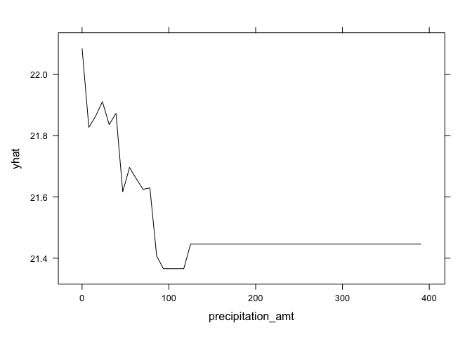
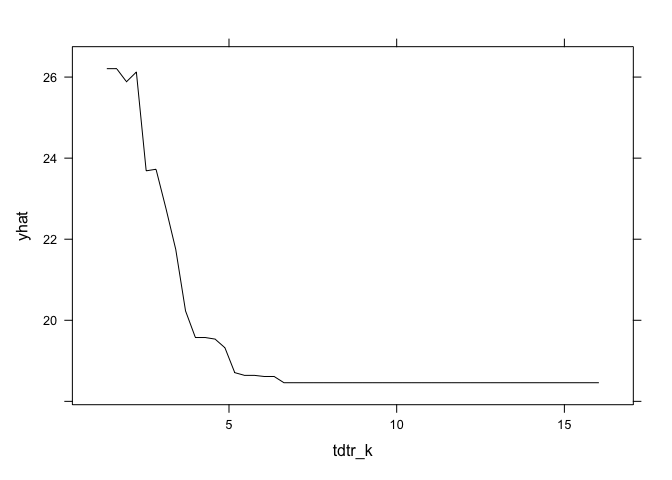

## 1. What Causes What?

1.  All cities are different, and the circumstances of an increased
    number of matter in terms of answering the question of how more cops
    affect street crime. Just because more police lowers crime rate in
    one city does not mean that it does so in another. So aggregating
    different cities could confound the results. Furthermore, increasing
    police because of expected higher crime rates might confound the
    results as well (it may even show that more police correlate with
    higher crime).

2.  The researchers were able to isolate this affect by using a natural
    experiment. They found no relationship between high terror alert
    days and crime. On high-alert days, there were more police because
    not because of crime so the researchers could isolate the affect of
    police number on crime. The table basically shows that if multiple
    samples were drawn from the same population, we would expect the
    true population value of the coefficients to be found within 95% of
    the samples (99% for the 1% level).

3.  They wanted to ensure that the effect of metro ridership (a proxy
    for how many people are out and about) did not change. This is
    because if there are significantly less people out on high-alert
    days, then crime could potentially be lower because less criminals
    are on the street or could potentially be higher because there are
    less people able to observe crimes being committed. Either way, that
    would confound the results of the variable of interest.

4.  The model being estimated here shows the effect of high-alert days
    (meaning more police) on District 1 and all other districts,
    controlling for midday ridership. The results show that there is a
    statistically significant reduction in crime for District 1 on
    high-alert days but not all other districts (grouped together). I am
    not sure if District 1 had more police on high-alert days but the
    other districts did not as this could further support the conclusion
    that more police reduces crime rates. Or if there were more police
    in all districts, it could mean indicate that more police may reduce
    crime rates in some areas but not others.

 

## 2. Tree Modeling: Dengue Cases

In this section, I use 3 methods (CART, Random Forest, and
Gradient-boosted Trees) to predict dengue cases. For each method, I
create and display the results of two models. Model\_1 for each method
uses data that removes all rows with NaN values (removes 214 rows).
Model\_2 for each method uses data that removes 60 rows with NaN values
and also removes the ndvi\_nw variable.

For both models, I hold out 25% of the data as a test set.

### a. CART

The following show the RMSE for the CART method for both models:

    ## CART in-sample RMSE (Model_1): 30.83161

    ## CART out-of-sample RMSE (Model_1): 29.85353

    ## CART in-sample RMSE (Model_2): 30.59165

    ## CART out-of-sample RMSE (Model_2): 28.60888

### b. Random Forest

The following show the RMSE of the Random Forest method for both models:

    ## Random Forest in-sample RMSE (Model_1): 12.18154

    ## Random Forest out-of-sample RMSE (Model_1): 26.92401

    ## Random Forest in-sample RMSE (Model_2): 12.05118

    ## Random Forest out-of-sample RMSE (Model_2): 25.393

### c. Gradient\_boosted Trees

The following show the RMSE of the Gradient-boosted Tree method for both
models. This method has the lowest RMSEs. Model\_2 has the lowest RMSE
of all models performed thus far.

    ## Using 199 trees...

    ## Gradient-boosted Tree in-sample RMSE (Model_1): 21.84527

    ## Using 199 trees...

    ## Gradient-boosted Tree out-of-sample RMSE (Model_1): 26.41055

    ## Using 182 trees...

    ## Gradient-boosted Tree in-sample RMSE (Model_2): 22.52997

    ## Using 182 trees...

    ## Gradient-boosted Tree out-of-sample RMSE (Model_2): 24.51427

### d. Partial Dependence Plots of Gradient\_boosted Trees for Model\_2

Note that the gbm function used 182 trees above, so the following
partial dependence plots have n.trees set to 182.

