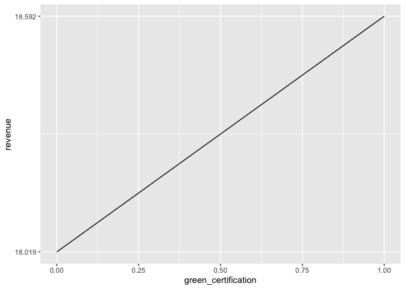

## 1. What Causes What?

1.  All cities are different, and the circumstances of an increased
    number of matter in terms of answering the question of how more cops
    affect street crime. Just because more police lowers crime rate in
    one city does not mean that it does so in another. So aggregating
    different cities could confound the results. Furthermore, increasing
    police because of expected higher crime rates might confound the
    results as well (it may even show that more police correlate with
    higher crime).

2.  The researchers were able to isolate this affect by using a natural
    experiment. They found no relationship between high terror alert
    days and crime. On high-alert days, there were more police because
    not because of crime so the researchers could isolate the affect of
    police number on crime. The table basically shows that if multiple
    samples were drawn from the same population, we would expect the
    true population value of the coefficients to be found within 95% of
    the samples (99% for the 1% level).

3.  They wanted to ensure that the effect of metro ridership (a proxy
    for how many people are out and about) did not change. This is
    because if there are significantly less people out on high-alert
    days, then crime could potentially be lower because less criminals
    are on the street or could potentially be higher because there are
    less people able to observe crimes being committed. Either way, that
    would confound the results of the variable of interest.

4.  The model being estimated here shows the effect of high-alert days
    (meaning more police) on District 1 and all other districts,
    controlling for midday ridership. The results show that there is a
    statistically significant reduction in crime for District 1 on
    high-alert days but not all other districts (grouped together). I am
    not sure if District 1 had more police on high-alert days but the
    other districts did not as this could further support the conclusion
    that more police reduces crime rates. Or if there were more police
    in all districts, it could mean indicate that more police may reduce
    crime rates in some areas but not others.

 

## 2. Tree Modeling: Dengue Cases

In this section, I use 3 methods (CART, Random Forest, and
Gradient-boosted Trees) to predict dengue cases. For each method, I
create and display the results of two models. Model\_1 for each method
uses data that removes all rows with NaN values (removes 214 rows).
Model\_2 for each method uses data that removes 60 rows with NaN values
and also removes the ndvi\_nw variable.

For both models, I hold out 25% of the data as a test set.

### a. CART

The following show the RMSE for the CART method for both models:

    ## CART in-sample RMSE (Model_1): 30.83161

    ## CART out-of-sample RMSE (Model_1): 29.85353

    ## CART in-sample RMSE (Model_2): 30.59165

    ## CART out-of-sample RMSE (Model_2): 28.60888

### b. Random Forest

The following show the RMSE of the Random Forest method for both models:

    ## Random Forest in-sample RMSE (Model_1): 12.18154

    ## Random Forest out-of-sample RMSE (Model_1): 26.92401

    ## Random Forest in-sample RMSE (Model_2): 12.05118

    ## Random Forest out-of-sample RMSE (Model_2): 25.393

### c. Gradient\_boosted Trees

The following show the RMSE of the Gradient-boosted Tree method for both
models. This method has the lowest RMSEs. Model\_2 has the lowest RMSE
of all models performed thus far.

    ## Using 199 trees...

    ## Gradient-boosted Tree in-sample RMSE (Model_1): 21.84527

    ## Using 199 trees...

    ## Gradient-boosted Tree out-of-sample RMSE (Model_1): 26.41055

 

    ## Using 182 trees...

    ## Gradient-boosted Tree in-sample RMSE (Model_2): 22.52997

    ## Using 182 trees...

    ## Gradient-boosted Tree out-of-sample RMSE (Model_2): 24.51427

### d. Partial Dependence Plots of Gradient\_boosted Trees for Model\_2

Note that the gbm function used 182 trees above, so the following
partial dependence plots have n.trees set to 182.

## 3. Predictive Model Building: Green Certification

### Introduction

The goal of this exercise is to build the best predictive model possible
for ‘revenue per square foot per calendar year’ and to use this model to
quantify the average change in rental income per square foot associated
with ‘green certification’, holding other features of the building
constant. In this exercise, I build three models:a linear model, a
random forest model, a gradient-boosted tree model, and a stacked model
that combines the three models. I then create a partial dependence plot
of the stacked model to quantify the average change in rental income
associated with ‘green certification’.

### Methods

Although not shown in the report, worthy of note is that I performed the
following analysis using 5 different random seeds for all models. The
results were consistent through all random seeds.

#### Data Preparation

I partitioned the dataset into a training set and a test set using an
80-20 split. For all models, the training set is used for training the
model, hyperparameter tuning, and model selection. In other words,
k-fold cross validation for the linear model and the gradient-boosted
tree model are done on the training set. The coefficients for the
stacked model are also evaluated on the training set. The test set is
reserved to evaluate the models’ final performance on data that it has
not yet seen.

For all models, I designated ‘revenue’ (the product of ‘Rent’ and
‘leasing\_rate) as the response variable. I then removed ’Rent’ and
‘leasing\_rate’ from the model. I removed ‘LEED’ and ‘Energystar’ from
the models as I am evaluating ‘green\_certification’ (a building is
green\_certified if it has either a ‘LEED’ or ‘Energystar’
certification). Also removed from all models are the “CS\_PorpertyID”
and “total\_dd\_07” to reduce noise.

There were also 225 observations that I removed doe either having NaN
values or having a leasing\_rate of 0. This is because these
observations are likely due to certain buildings undergoing renovations
or other unknown factors, and they likely add unnecessary noise to the
data.

#### Stepwise Linear Model

I first wanted to see the effect of ‘green\_rating’(the variable name
for ‘green\_certification’) on ‘revenue’ in a linear model as this is
generally the most interpretable.

For the linear model, I performed step-wise selection. I removed
‘cluster’ as there were too many clusters to treat this as a categorical
variable. I also removed ‘green\_rating’ for the initial training of the
step-wise model. This is because this model takes into account all
feature variables and their interactions. Once the model was trained, I
added ‘green\_rating’ back into the model without interactions in order
to leave the effect of ‘green\_rating’ on ‘revenue’ more interpretable.

Once the linear model was trained and selected, I added ‘green\_rating’
back into the linear model and performed K-fold cross using 5 folds. The
following show the RMSEs for both the training and testing sets. Note
that the RMSE for both the training and testing sets are approximately
equal (this was consistent over 5 random seeds).

    ## Linear Model in-sample mean RMSE of 5 folds: 9.8702

    ## Linear Model out-of-sample RMSE: 9.8717

The following shows the summary statistics for ‘green\_rating’. This
model shows that holding all other variables constant, having a
‘green\_certification’ increases the ‘revenue per square foot per
calendar year’ by about $1.32.

    ##   Estimate Std. Error    t value   Pr(>|t|) 
    ##     1.3205     0.4717     2.7995     0.0051

#### Random Forest Model

For this model, cross-validation was not conducted on the training set.
However, the RMSE results were consistent across 5 random seeds.The
following show the RMSEs of the Random Forest Model using 500 trees as
performance did not improve by adding more trees.

    ## Random Forest Model in-sample RMSE: 4.171903

    ## Random Forest Model out-of-sample RMSE: 7.473891

#### Gradient-boosted Tree Model

The Gradient-boosted Tree Model was trained using 5 cross validated
folds with an interaction depth of 13, a shrinkage of 0.3, and 1,000
trees. Although the RMSE of the test set was smaller than that of the
Random Forest Model and the RMSEs were fairly consistent, it is worthy
to note that the Random Forest Model outperformed this model across 3 of
5 random seeds. The following show the RMSEs of the Gradient-boosted
Tree Model.

    ## Random Forest Model in-sample RMSE: 1.741099

    ## Random Forest Model out-of-sample RMSE: 7.262793

#### Stacked Model

Finally, I used a Stacked Model, in which I used an ensemble approach
combining the predictions of the three previous models using a Linear
Regression model as a second level learner to stack the individual model
predictions. I also tried this approach using 5 different Random Forest
Models, but the RMSE for the Stacked Model using a Linear Model, a
Random Forest Model, and a Gradient-boosted Tree Model consistently gave
lower RMSEs.

The following shows the in-sample RMSE for the Stacked Model.

    ## Stacked Model in-sample RMSE: 1.68936

The following shows the coefficients of the second-level learner. Note
that these coefficients were all generated using the training set. Not
that these are ultimately used to generate predictions for the Stacked
Model in the test set.

    ## (Intercept)    gbm_pred forest_pred     lm_pred 
    ## -0.04374805  0.94938894  0.12318462 -0.07056185

The following show the out-of-sample RMSE of the Stacked Model.

    ## Stacked Model out-of-sample RMSE: 7.204655

### Modeling Choice

I chose to use the Stacked Model as my final predictive model. This is
because the RMSEs of this model were extremely consistent across 5
different random seeds, and outperformed all previous models across 4 of
5 random seeds. It only slightly unperformed the Random Forest Model on
one iteration. Although fairly consistent, the changes in RMSEs for the
Random Forest and Gradient-boosted Tree Models could indicate a small
amount of overfitting. Consequently, it seemed that by ensembling the
three models I initially fit, I improved predictive accuracy and reduced
the risk of overfitting.

#### Partial Dependence of Green Certification

As my model of choice was the stacked model, I also calculated the
partial dependence of ‘green\_certification’ using a combination of the
partial dependencies from the Linear Model, the Random Forest Model, and
the Gradient-boosted Tree Model. I did this by first generating the
partial dependencies of each model individually. I then weighted the
respective partial dependencies by using the inverse of the RMSE and
scaling those weights to that the sum to 1. In other words, the models
with lower RMSE have more weight.

The following show the partial dependence of ‘green\_certification’, and
plots it. Note this shows that holding all other variables constant,
having a ‘green\_certification’ increases the ‘revenue per square foot
per calendar year’ by about $0.61.

    ## Partial Dependece of Green Certification: 0.573

### Conclusion

The Stacked Model likely performed the best because it leverages the
strengths of the other models and minimizes their weaknesses. For
example, the Linear Model showed that holding all other variables
constant, having a ‘green\_certification’ increases the ‘revenue per
square foot per calendar year’ by about $1.32. Although this seems like
a small number, it is actually ver significant. If a building has about
50 rooms averaging about 1,000 square feet, the difference in ‘revenue’
is approximately $66,000. There could be other factors not captured in
the data that a linear model can account for that could contribute to
this difference. In other words, we would need more data to train a
better linear model as it is extremely difficult for a linear model to
capture nuances based on the current dataset.

The Random Forest and Gradient-boosted Tree Models are better able to
capture the nuances in the data. However, this is done at the risk of
overfitting. Consequently, by creating a Stacked Model, the risk of
overfitting is reduced. The partial dependence of the Stacked Model
showed that holding all other variables constant, having a
‘green\_certification’ increases the ‘revenue per square foot per
calendar year’ by about $0.57. If a building has about 50 rooms
averaging about 1,000 square feet, the difference in ‘revenue’ is now
approximately $28,500.

Although much improved from the Linear Model, the RMSE of the Stacked
Model is still pretty high at $7.205. More accurate predictions and a
more accurate partial dependency of ‘green\_certification’ can be
achieved with more relevant data. This dataset contains data on
commercial rental properties from across the United States, but does not
even have the city and state in which these properties are located.
Although the City\_Market\_Rent variable may capture some of this, even
different locations within a city could have significantly different
revenues.

Overall, it seems like having a Green Certification does seem to have a
positive effect on revenue, but based on the current amount of data, I
cannot confidently conclude that it is a $0.57 increase in ‘revenue per
square foot per calendar year’ or that this relationship is causal.

## 4. Predictive Model Building: California Housing

### Methods

On this exercise, I generated 4 models: a KNN Model, a Random Forest
Model, a GBM model, and a Stacked Model. I partitioned the dataset into
a training set and a test set using an 80-20 split. For all models, the
training set is used for training the model, hyperparameter tuning, and
model selection. All K-fold cross validation was done on the training
set; the test set was reserved for final validation of the models.

#### KNN Model

The KNN Model was used as an initial Benchmark. The following show the
RMSEs. The in-sample RMSE was generated using an average of 5
cross-validated RMSEs. The out-of-sample RMSE show the RMSE of
predictions on the test set.

    ## KNN in-sample RMSE: 64426.16

    ## KNN out-of-sample RMSE: 61816.65

#### Random Forest Model

The following show the RMSE results for the Random Forest Model. These
show that there was significant improvement from the KNN Model, and
serves as another benchmark to compare the GBM model to.

    ## Random Forest Model in-sample RMSE: 22931.11

    ## Random Forest Model out-of-sample RMSE: 53022.07

#### GBM Model

The GBM Model was trained using 5 cross validated folds with an
interaction depth of 10, a shrinkage of 0.1, and 1,000 trees. This model
outperformed the Random Forest Model over 5 random seeds. The following
show the RMSEs of the GBM Model.

    ## GBM in-sample RMSE: 30756.46

    ## GBM out-of-sample RMSE: 46843.96

#### Stacked Model

Finally, I used a Stacked Model, in which I used an ensemble approach
combining the predictions of the three separate GBM Models and used
another GBM Model as a second level learner to stack the individual
model predictions. Each GBM Model was generated by using a different
random seed. Although the improvement on this model was relatively
minor, this model outperformed the normal GBM Model over 5 random seeds.
Consequently, this is my model of choice for generating the best
predictive model. The following show the RMSEs of this model.

    ## Stacked Model in-sample RMSE: 29058.24

    ## Stacked Model out-of-sample RMSE: 46224.05

#### Cross-Validated Predictions using the Stacked Model

Because I want to plot my predictions and residuals versus the
geolocation, I generated cross-validated predictions using my stacked
model. I first created 5 folds, using 4 folds as the training set and 1
fold as the test set. Using the training set, I created 3 separate GBM
Models and passed them through a second-level learner (also using GBM)
to generate predictions for the test set. I did this until each fold was
used as a test set once so that out-of-sample predictions was generated
for the whole dataset.

The following shows the average RMSE of my predictions versus the actual
medianHouseValues. This is the overall out-of-sample accuracy of my
proposed model.

    ## Stacked Model out-of-sample RMSE: 45850.39

#### Maps

Plot using a color scale to show medianHouseValue versus longitude (x)
and latitude (y).

Plot using a color scale to show predicted medianHouseValue versus
longitude (x) and latitude (y).

Plot using a color scale to show residuals versus longitude (x) and
latitude (y).
