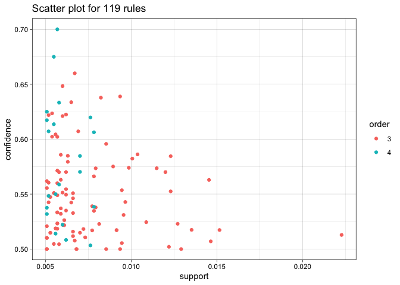

## 1. Clustering and PCA

### PCA

#### Wine Color

I want to first look at how PCA can help us distinguish white wines from
red wines.

As we can see, with 2 principle components, PCA can help us distinguish
most red wines from white wines.

#### Wine Quality

With 2 principal components, it seems that as PC2 values get lower, the
quality increases. However, this is not very conclusive and PC1 is not
very informative regarding the wine quality.

Now looking at the PC2 and PC3, we can see that wines generally score
better when PC2 and PC3 are both less than 0.

This may not work on an .md file but the folowing is an interactive 3d
plot of the 3 principal components. This pretty much tells the same
story as the plot for PC2 and PC3.

### K-means

We can first create an elbow plot to see the optimal number of clusters.
I found this to be 5 clusters. For this portion, I want to focus on what
K-means can tell us about the quality.

The plot below helps visualize the proportion of each wine quality
scores for each cluster. Although not particularly helpful in
distinguishing higher quality wines from lower quality ones, we can see
that cluster 2 offers a better chance of having a better wine score.

In summary, looking at the first 2 principal components in PCA does a
terrific jobs in distinguishing red from white wines. Looking at the
first 3 components, it also helps us distinguish wine quality. Although
K-means clustering with 5 clusters does offer some insights, it is not
particularly helpful.

## 2. Market Segmentation

### NutrientH2O Report

K-means clustering often offers good, interpretable insights into
marketing segments. Based on the information from the elbow plot shown
below, I group followers into 5 segments and give the conclusions of
what advertising to the different segments might entail.

#### Marketing Segments

Using 5 clusters, I calculated the mean of each variable for each
cluster. Below, I show the heatmap of the means for reference along with
the market segment of each cluster based on the limited knowledge
gathered from the particular topics.

Cluster 1: photo\_sharing, cooking Cluster 2: sports, food, religion,
parenting, some photo sharing Cluster 3: Not very active on social media
or not particularly interested in just a few topics Cluster 4: travel,
politics, news Cluster 5: health\_nutrition, personal\_fitness, some
photo sharing

#### Interpreting the Segments

The following offers a generalization of what the clusters or market
segments may entail.

1.  Cluster 1 seems to consist of users who like to share photos of
    their food. These people gnerally like to take lots of pictures of
    their meals and post them.

2.  Cluster 2 seems to consist of the ‘traditional’ parents. Their kids
    may play sports, they may go to church on Sundays, they probably
    watch football on Sundays, and they may sometimes share photos of
    family and friends getting together to have a meal.

3.  Nothing particular stands out about Cluster 3. They most likely do
    not post much but could possibly scroll through their feed as a form
    of entertainment.

4.  Cluster 4 seems to consist of businessmen and businesswomen. They
    are into politics and the news and may travel for work, or atleast
    have the money to travel more often for leisure.

5.  Cluster 5 may be the health and fitness fanatics. They like going to
    the gym, eating healthy foods, and may post pictures of them at the
    gym, their choice of protein shake, pre-workout, or nutritious meal.

#### Recommendations on Advertising

Now that we have interpreted the market segments, we need to identify
the proportion of people in each segment as seen below. Based on these
numbers and the conclusions drawn above, I make the following
recommendations:

    ## # A tibble: 5 × 2
    ##   cluster     n
    ##     <dbl> <int>
    ## 1       1   785
    ## 2       2   934
    ## 3       3   709
    ## 4       4   601
    ## 5       5  4804

Cluster 1: If the company wants their drink to appear very often in
posts, this would be the segment to advertise to. This is because this
segment posts the most pictures of their food, in which drinks often
appear beside. The drawback is that many people do not look too closely
at their feed, and the company’s drink may not be noticed as people are
focused on the decorative food on these follower’s plates.

Cluster 2: This segment does not have many posts. However, this still
presents an interesting marketing opportunity as parents whose kids play
sports and have get-togethers will often buy sports drinks such as
NutrientH2O in bulk. Although they may not post as much, they could
potentially account for a good amount of profits.

Cluster 3: This segment likely represents the majority of the
population. Although not particularly interesting, advertising to this
segment most likely captures the greatest number of people. Whether they
are likely to buy the drink on based on the advertisement cannot be
determined.

Cluster 4: They account for a small proportion of the population and do
not offer any particular benefits. I do not recommend advertising to
this segment.

Cluster 5: This segment likely posts picture of their workout
supplements, in which NutrientH2O could be a part of especially during
their workout. These people may purchase drinks similar to NutrientH2O
to drink during their workouts and post pictures of the drink if they
like the taste and the perceived benefits. This segments posts seems to
offer more value than those in Cluster 1 as these followers would more
likely post NutrientH2O as the main attraction as opposed to those in
Cluster 1 whose post’s main attraction are probably the food.

## 3. Association Rules for Grocery Purchases

I played around with the confidence and lift values based on
observations from the plots below and the different results from a few
different combinations of confidence and lift.

In particular, by setting confidence to 0.5 and lift to 2, I found
strong associations between a variety of items and ‘other vehgetables’
or ‘whole milk’. On other words, it seems that when people buy other
things, they also tend to buy ‘other vegetanles’ and ‘whole milk’ as
well. For different values of confidence and lift, values made sense for
the most part. All seemd like combinations I would potentially buy based
on what I have or do not have at home.

However, one interesting rule I found was between ‘curd, tropical fruit’
and ‘yogurt’. This rule has a lift of 3.69 and a confidence of 0.51. In
fact, this has the highest lift given the confidence and support chosen.
Although this was not an association I would typically expect, both the
lift and confidence are high relative to the remainder of the
associations.

Note that although there are about 100 observations, I only show the
first and last 10 observations to reduce clutter in this report. Note
that all values in between the head and tail have rhs as either ‘other
vegetable’ or ‘milk’

    ##      lhs                     rhs                    support confidence    coverage     lift count
    ## [1]  {curd,                                                                                      
    ##       tropical fruit}     => {yogurt}           0.005287239  0.5148515 0.010269446 3.690645    52
    ## [2]  {citrus fruit,                                                                              
    ##       root vegetables,                                                                           
    ##       whole milk}         => {other vegetables} 0.005795628  0.6333333 0.009150991 3.273165    57
    ## [3]  {pip fruit,                                                                                 
    ##       root vegetables,                                                                           
    ##       whole milk}         => {other vegetables} 0.005490595  0.6136364 0.008947636 3.171368    54
    ## [4]  {pip fruit,                                                                                 
    ##       whipped/sour cream} => {other vegetables} 0.005592272  0.6043956 0.009252669 3.123610    55
    ## [5]  {onions,                                                                                    
    ##       root vegetables}    => {other vegetables} 0.005693950  0.6021505 0.009456024 3.112008    56
    ## [6]  {citrus fruit,                                                                              
    ##       root vegetables}    => {other vegetables} 0.010371124  0.5862069 0.017691917 3.029608   102
    ## [7]  {root vegetables,                                                                           
    ##       tropical fruit,                                                                            
    ##       whole milk}         => {other vegetables} 0.007015760  0.5847458 0.011997966 3.022057    69
    ## [8]  {root vegetables,                                                                           
    ##       tropical fruit}     => {other vegetables} 0.012302999  0.5845411 0.021047280 3.020999   121
    ## [9]  {butter,                                                                                    
    ##       whipped/sour cream} => {other vegetables} 0.005795628  0.5700000 0.010167768 2.945849    57
    ## [10] {tropical fruit,                                                                            
    ##       whipped/sour cream} => {other vegetables} 0.007829181  0.5661765 0.013828165 2.926088    77

    ##      lhs                                rhs          support     confidence
    ## [1]  {coffee, yogurt}                => {whole milk} 0.005083884 0.5208333 
    ## [2]  {pip fruit, sausage}            => {whole milk} 0.005592272 0.5188679 
    ## [3]  {pastry, root vegetables}       => {whole milk} 0.005693950 0.5185185 
    ## [4]  {sausage, tropical fruit}       => {whole milk} 0.007219115 0.5182482 
    ## [5]  {other vegetables, pip fruit}   => {whole milk} 0.013523132 0.5175097 
    ## [6]  {tropical fruit, yogurt}        => {whole milk} 0.015149975 0.5173611 
    ## [7]  {pastry, yogurt}                => {whole milk} 0.009150991 0.5172414 
    ## [8]  {citrus fruit, root vegetables} => {whole milk} 0.009150991 0.5172414 
    ## [9]  {root vegetables, sausage}      => {whole milk} 0.007727504 0.5170068 
    ## [10] {other vegetables, yogurt}      => {whole milk} 0.022267412 0.5128806 
    ##      coverage    lift     count
    ## [1]  0.009761057 2.038359  50  
    ## [2]  0.010777834 2.030667  55  
    ## [3]  0.010981190 2.029299  56  
    ## [4]  0.013929842 2.028241  71  
    ## [5]  0.026131164 2.025351 133  
    ## [6]  0.029283172 2.024770 149  
    ## [7]  0.017691917 2.024301  90  
    ## [8]  0.017691917 2.024301  90  
    ## [9]  0.014946619 2.023383  76  
    ## [10] 0.043416370 2.007235 219

Plot of all the rules in (support, confidence) space

Two-key plot: coloring is by size of item set.

